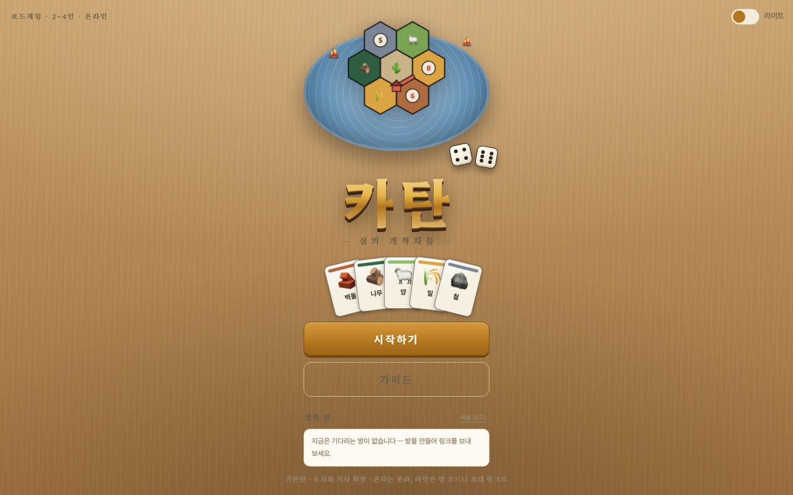

# 🌾 카탄

  [](https://catan.41ways.workers.dev/) [](https://41ways.github.io/norara/)

주사위가 자원을 나눠주고, 자원으로 도로·마을·도시를 짓는 카탄. 기본판과 「도시와 기사」 확장 둘 다 있다.
방 코드나 초대 링크로 최대 4인이 붙는다. 온라인 판은 서버(Cloudflare Workers + Durable Object)가 심판을 맡고,
혼자 하기(봇과)는 서버를 거치지 않고 브라우저에서 돈다. 계정은 없다.




## 한눈에

| | |
|---|---|
| **종류** | 보드게임 · 온라인 |
| **인원** | 2~4인 (봇으로 채우면 혼자도) |
| **플레이** | **https://catan.41ways.workers.dev/** (옛 주소는 여기로 넘어간다) |
| **로컬 실행** | `npm install && npm start` → http://localhost:8878 |
| **한 줄 규칙** | 주사위로 자원을 받아 도로·마을·도시를 짓고, 자기 차례에 10점을 먼저 넘기면 이긴다 |
| **허브** | https://41ways.github.io/norara/ |

**목차** — [규칙](#규칙) · [처음이면](#처음이면) · [조작](#조작) · [실행](#실행) · [대기실](#대기실) · [배포](#배포) · [통신](#통신) · [파일](#파일) · [봇](#봇) · [테스트](#테스트) · [알려진 제약](#알려진-제약)

## 규칙

기본판 그대로다.

- **땅 타일 19개** — 숲·초원·농지 4개씩, 언덕·산 3개씩, 사막 1개. 숫자 칩 18개(2·12 하나씩, 나머지 둘씩).
  **사막은 언제나 한가운데**(숫자 없음, 도둑의 시작 자리)고 나머지 18개만 매판 무작위로 깐다.
  **6·8이 붙거나 같은 숫자가 붙는 배치는 다시 깐다.**
- **항구 9개** — 3:1 넷, 자원별 2:1 다섯. 바닷가에 배지로 붙는다.
- **자원 5종 각 19장** — 언덕→벽돌, 숲→나무, 초원→양, 농지→밀, 산→철. 은행이 바닥나면 못 받는다
  (한 명만 받을 상황이면 남은 만큼, 여럿이면 아무도 못 받는 공식 룰).
- **건설** — 도로 벽돌+나무(15개), 마을 벽돌+나무+양+밀(5개, 1점), 도시 밀2+철3(4개, 2점).
  마을은 내 도로에 이어서, 어느 마을과도 두 변 이상 떨어뜨려서. 남의 마을 너머로는 도로가 못 지나간다.
- **준비** — 마을+도로를 한 바퀴, 역순으로 한 바퀴 더. 두 번째 마을 둘레의 자원을 받고 시작한다.
- **7 · 도둑** — 8장 이상 든 사람은 절반(내림)을 버린다. 도둑을 옮기고 그 둘레 한 명에게서 한 장을 뽑는다.
  도둑이 앉은 타일은 생산이 멈춘다(판에서 빗금으로 표시). 도둑은 가운데 사막에서 시작한다.
- **발전 카드 25장** — 기사 14, 승점 5, 도로 건설·자원 발견·독점 각 2. 양+밀+철.
  산 턴에는 못 쓰고 한 턴에 한 장. 승점 카드는 예외로 그냥 점수로 센다.
- **거래** — 차례인 사람만. 은행 4:1, 3:1 항구, 자원별 2:1 항구.
  사람끼리는 제안을 올리면 각자 받기/거절을 누르고, 제안자가 상대를 골라 성사시킨다.
  같은 자원을 주고받는 제안, 공짜로 주는 제안은 룰대로 막았다.
- **최장 교역로 2점** — 갈림길 제외 5개 이상, 더 긴 사람이 나오면 넘어간다(동점이면 유지).
  도로 가운데 남의 마을이 서면 거기서 끊긴 것으로 센다.
- **최강 기사단 2점** — 기사 3장 이상, 더 많이 쓴 사람이 나오면 넘어간다.
- **승리** — 자기 차례에 10점. 남의 차례에 10점이 되면(교역로를 어부지리로 받는 경우 등)
  자기 차례가 돌아온 순간 이긴다.

## 처음이면

처음 열면 **여섯 장짜리 안내**가 먼저 뜬다. 화면 아래 안내줄이 매 단계 지금 할 일을 알려주고,
오른쪽 위 `도움말` 에 규칙 요약과 건설 비용표가 있다.

## 조작

- 판에서 **주황 점**(마을 자리)이나 **점선 변**(도로 자리)을 바로 누른다.
- 내 차례에는 아래 `도로` `마을` `도시` 버튼으로 짓기 모드를 켜고 자리를 누른다.
  자원이 모자라면 버튼이 꺼져 있다.
- 7이 나오면 내 손패에서 버릴 카드를 눌러 고르고, 도둑은 옮길 타일을 누른다.
- 발전 카드는 손패 옆에 칩으로 뜨고, 누르면 쓴다. 산 턴에는 흐리게 표시된다.

## 실행

```
npm install
npm start            # node server.js — http://localhost:8878
```

`server.js` 는 `public/` 을 정적 파일로 내주고 `/ws` 로 소켓을 받는 Node 서버다. 로컬 개발과 테스트용이고,
실제 서비스는 Cloudflare(`worker.js`)에서 같은 `game.js` 로 돈다. 모바일 폭에 맞춰 만들었다.

타이틀에는 `시작하기` · 가이드 버튼과 **열린 방** 목록을 둔다. `시작하기` 를 누르면 고르는 화면이 나온다.

- **판 종류** — 기본판(10점)과 「도시와 기사」(13점). 혼자 연습과 방 만들기에 같이 쓰고, 방장은 대기실에서도 바꿀 수 있다.
- **혼자 연습** — 봇 1~3명과. 실력 3단계. 서버를 거치지 않고 이 브라우저에서 판이 돈다.
- **방 만들기** — 4자리 코드가 나온다. 코드나 초대 링크로 친구가 들어온다. 비공개로 만들 수도 있다.
- **참가** — 코드를 넣거나, 타이틀의 열린 방 목록에서 고른다.

## 대기실

- **초대 링크 복사** — `?room=CODE` 주소다. 이 링크로 열면 고르는 화면에 코드가 채워져 있다.
- **열린 방** — 시작 전이고 자리가 남은 공개 방을 타이틀에서 6초마다 새로 본다. 누르면 코드를 채워 고르는 화면으로 간다.
- **비공개 방** — 만들 때 고르거나 방장이 대기실에서 켠다. 목록에 안 보이고 코드·링크로만 들어온다.
- **판 종류 · 봇 실력 · 봇 추가 · 내보내기** — 방장만. 봇 실력은 방 설정이라 그 방의 봇 모두에 적용된다.
- **채팅** — 사람이 둘 이상이면 뜬다(판 중에는 판 왼쪽 아래). 서버가 같은 방에만 돌려주고 저장하지 않는다.
  접어 둔 동안 온 말은 빨간 숫자 · 말풍선 · 탭 제목의 `(n)` 세 군데로 알린다.
- **새로고침** — 탭마다 자리표(`sessionStorage`)를 적어 두어, 새로고침해도 같은 자리로 돌아온다.
  같은 자리를 다른 탭이 이어받으면 먼저 탭은 쉬고(4001), 누르면 다시 가져온다.
- **방장이 나가면** — 끊긴 방장은 20초 기다렸다가 붙어 있는 사람에게 넘긴다. 그 안에 돌아오면 그대로 방장이다.
  모두 끊겼다가 먼저 돌아온 사람이 방장을 맡는다. 판은 방장과 상관없이 이어진다.
- **판 중에 끊기면** — 그 사람이 **해야 할 일**(내 차례 · 순서 주사위 · 7 버리기)이 오면 20초 기다린다.
  돌아오지 않으면 판에서 빠지고 남은 사람끼리 계속한다. 남은 게 **거래 대답**뿐이면 판에서 빼지 않고
  대신 거절로 답한다(제안자가 다른 사람과 성사시킬 수 있게). 판 위 `나가기` 를 누르면 곧바로 빠진다.
- **판이 끝나면** — 방장이 `한 판 더` 를 누르면 모두 대기실로 돌아간다.

## 배포

Cloudflare Workers 무료 플랜. `wrangler.toml` 에 설정이 다 들어 있다.
화면 파일(`public/`)은 정적 자산으로, 소켓(`/ws`)과 상태 확인(`/healthz`)만 Durable Object 하나(`main`)로 간다.
카드 원화(`image/` 의 PNG)와 규칙서 PDF 는 `public/` 밖이라 올라가지 않는다 — 화면은 `public/img/` 의 webp 만 쓴다.

```
./bump.sh              # 자산 URL 의 ?v= 를 내용 해시로 갱신
npx wrangler login     # 처음 한 번
npx wrangler deploy
```

무료 한도는 "객체가 켜져 있는 시간"이 먼저 찬다. 그래서

- 탭은 25초마다 ping 을 보내고, 2분 반 넘게 소식이 없는 소켓은 끊긴 것으로 친다.
- 20분 동안 아무 조작이 없는 소켓은 서버가 닫는다(4000). 화면은 아무 곳이나 누르면 다시 붙는다.
  대기실 자리는 이때 지우지 않는다(사람이 나간 게 아니라서).
- 되풀이 타이머는 30초 청소 하나뿐이다. `game.js` 는 봇 차례 · 끊긴 사람 기다리기 · 방장 넘기기처럼
  할 일이 생길 때만 한 번짜리 타이머를 건다. 사람이 오래 생각해도 서버가 스스로 깨어 도는 일은 없다.
- 방도 소켓도 없으면 청소 타이머까지 멈춰 객체가 잠든다. 혼자 하기를 누르면 방 목록용 연결도 내려놓는다.

`/healthz` 는 `{"ok":true,"rooms":N,"sockets":N}` 을 돌려준다.

## 통신

**서버가 심판이다.** 판(땅 · 더미 · 손패 · 차례)과 봇은 전부 `game.js` 가 쥐고, 규칙 판정은
`rules.js`(기본판) · `ck.js`(도시와 기사)가 한다. 어느 엔진을 쓸지는 방 설정이고 판마다 하나만 쓴다.
화면은 `{t:'act', action, args}` 로 하고 싶은 행동만 보내고, 규칙에 어긋나면 이유가 돌아와 토스트로 뜬다.
신원은 소켓이 정하므로 남의 차례를 가로챌 수 없다.

사람마다 `viewFor()` 로 볼 수 있는 만큼만 잘라서 보낸다. 판 상태를 통째로 보내는 길은 하나도 없다.

- 남의 손패는 **장수만**, 발전 카드·진보카드는 **몇 장인지만**. 기본판의 승점 카드는 끝날 때까지 안 보인다.
- 도둑·주교·첩자로 오간 카드는 **당사자 둘에게만** 기록 줄로 간다(`only`).
- 더미 순서와 주사위 씨앗은 아무에게도 안 간다. 예전(PeerJS P2P)에는 방장이 다 볼 수 있었다.
- `test/flow.js` 가 손님들이 받은 **모든 메시지**를 훑어 이 규칙이 한 번이라도 깨지면 실패시킨다.

**여러 사람을 기다리는 단계**(순서 주사위 · 7 버리기 · 거래 제안)는 규칙 엔진의 상태 그대로다.
서버는 `needsAction()` · `tradePending()` 으로 아직 안 한 사람을 읽어 봇을 움직이고,
끊긴 사람은 20초 뒤 판에서 빼거나(해야 할 일) 대신 거절한다(거래 대답).
거래는 제안자가 올리면 → 각자 받기/거절을 누르고 → 제안자가 받겠다고 한 사람 중에서 골라 성사시킨다.
그 사이 누가 끊기거나 나가도 제안은 남거나(대신 거절) 걷힌다(제안자가 나감).

봇이 곧바로 두면 방금 무슨 일이 있었는지 읽기 전에 판이 바뀐다. 서버는 화면이 중계 줄을 띄워 두는 시간
(0.85초 + 글자당 0.075초, 최소 1.3초)과 주사위 연출(2.3초)을 더해 다음 봇 수를 미룬다. 볼 사람이 없으면 쌓지 않는다.

**혼자 하기는 브라우저에서 돈다.** 서버 한도를 아끼려고, 봇과 하는 판은 예전처럼 `app.js` 가 같은
엔진·봇 파일로 직접 돌린다. 온라인 판과 같은 `applyView` 로 그리므로 판 화면 코드는 하나다.

### 규칙 엔진·봇 파일을 양쪽에서 쓰는 법

원본은 저장소 루트에 하나씩만 있다. 네 파일 모두 끝에서 `self`(브라우저·Workers) 전역에 붙는다.

- 서버 — `game.js` 가 `require('./rules')` 처럼 부른다(Node 에는 `self` 가 없어 `game.js` 가 하나 만들어 준다).
  wrangler 가 묶을 때 그대로 따라 들어간다. **엔진·봇 파일은 한 글자도 고치지 않았다.**
- 화면 — `public/rules.js` · `ai.js` · `ck.js` · `ck-ai.js` 는 루트 원본을 가리키는 **심볼릭 링크**다.
  Node 서버는 링크를 따라 읽고, wrangler 는 자산을 모을 때 링크를 따라가 원본 내용을 올린다. 복사본도 빌드도 없다.
  `test/smoke.js` 가 응답이 루트 원본과 글자 하나까지 같은지 확인한다 — 배포본에 대고도 돌려 볼 것.

## 파일

| 파일 | 역할 |
|---|---|
| `rules.js` | 기본판 규칙 엔진. 순수 함수. 네트워크도 UI도 모른다. 서버와 화면이 같이 쓴다 |
| `ck.js` | 「도시와 기사」 규칙 엔진. 상품·기사·야만족·진보카드 |
| `ai.js` `ck-ai.js` | 봇. 자리의 값어치를 주사위 눈 기대치로 재고 목표 하나를 향해 모은다 |
| `game.js` | 방 관리와 온라인 판 진행. 통신 방식은 모른다 |
| `worker.js` | Cloudflare Worker + Durable Object. 소켓을 `game.js` 에 잇는다 |
| `server.js` | 같은 `game.js` 를 Node `ws` 로 띄우는 로컬 서버 |
| `wrangler.toml` | Cloudflare 설정. 자산 `public/`, `/ws` · `/healthz` 만 Worker 로 |
| `index.html` | 옛 GitHub Pages 주소로 온 사람을 새 주소로 넘기는 한 장 |
| `public/index.html` `style.css` `app.js` | 화면. 판은 SVG로 그린다. 혼자 하기 진행, 온라인 연결 · 대기실 · 채팅 |
| `public/rules.js` `ai.js` `ck.js` `ck-ai.js` | 루트 원본을 가리키는 심볼릭 링크 |
| `rules.test.js` `ck.test.js` `ai.test.js` | 규칙 · 봇 테스트 |
| `test/flow.js` `test/smoke.js` | 서버 시나리오 테스트 · 떠 있는 서버 확인 |

## 봇

- 준비 단계에서는 **주사위 눈 기대치 + 자원 다양성 + 항구**로 자리를 고른다.
- 매 턴 목표(도시 → 마을 → 그 자리로 가는 도로 → 발전 카드)를 하나 정하고,
  남는 자원은 은행 교환으로 모자란 자원에 맞춘다. 도로는 **세 칸 앞**까지 내다보고 깐다.
- 도둑은 내 타일을 피해 선두의 생산이 가장 큰 타일에 앉힌다.
- 기사는 도둑이 내 타일에 앉았거나 최강 기사단이 눈앞일 때 쓴다.
- 거래 제안에는 손익과 자기 목표를 따져 대답한다. 실력을 낮추면 가끔 아무 수나 둔다.

## 테스트

```
npm test                                   # 아래 넷을 차례로
node rules.test.js
node ck.test.js
node ai.test.js
node test/flow.js                          # 서버를 8878 에 CATAN_FAST=1 로 띄워 시나리오를 돈다
node test/smoke.js http://127.0.0.1:8878   # 떠 있는 서버(어느 것이든) 확인
```

- 규칙 엔진 **1702개** — 판 구성(타일·칩·항구·가운데 사막 60판 검사), 준비 단계 뱀 순서, 생산과 은행 고갈,
  7과 버리기, 도둑과 강탈, 건설 규칙(간격·연결·말 개수), 최장 교역로(끊김 포함), 발전 카드 다섯 종,
  은행·항구·플레이어 간 거래, 승리 선언 타이밍, 그리고 **무작위 120판 완주**(매 수마다 자원 총량 검사)
- 도시와 기사 **135개** — 상품과 도시 개발, 기사(놓기·활동·승급·이동·도둑 쫓기), 야만족과 수도,
  진보카드 스물여섯 종, 성벽과 손패 한도, 완주
- 봇 **42개** — 자리 고르기, 완주(30판), 버리기, 도둑 자리, 그리고 **어려움이 쉬움을 이기는지**
- 서버 시나리오 **31개** (`test/flow.js`) — 방 만들기 · 참가 · 같은 이름 · 채팅, 방장만 되는 조작,
  비공개 방이 목록에서 빠지는지, 판 종류·봇 실력 설정, 사람마다 다른 시야, 남의 차례·규칙 위반·이상한 인자 거절,
  순서 주사위와 준비 두 바퀴, 건설, **사람끼리 거래**(제안·거절·거두기 / 수락·제안자가 골라 성사 / 셋이서 동시에 대답),
  **7에 둘이 동시에 버리기**와 도둑·강탈(무슨 카드인지는 당사자 둘만), 새로고침으로 자리 되찾기와 4001,
  방장이 끊기면 유예 뒤 넘겨지기, 끊긴 사람이 해야 할 일에서 빠지기(차례·순서 주사위·버리기),
  거래 대답만 남은 사람은 대신 거절, 제안자가 나가면 제안이 걷히기, 한 판 더,
  도시와 기사로 시작해 몇 차례, 사람 하나 + 봇 셋 **한 판 완주(기본판 · 도시와 기사 둘 다)**,
  그리고 **숨은 정보 검사** — 손님들이 받은 메시지 1700여 개를 하나하나 훑어 남의 손패·진보카드·숨은 승점·
  더미·씨앗·남만 볼 기록 줄이 한 번이라도 섞이면 실패시킨다.
  `CATAN_FAST=1` 이면 봇 뜸 · 중계 기다림 · 유예(300ms)가 짧아진다. 실제 유예가 20초인지는 따로 확인한다.
- 연결 확인 **12개** (`test/smoke.js`, `IDLE=1` 이면 13개) — 화면 파일, 링크로 둔 규칙 엔진·봇 파일이
  원본과 같은지, `/healthz`, 만들기 · 참가 · ping · 채팅 · 목록과 비공개 · 순서 주사위 · resume · 4001 ·
  나가기 · 확장판 방.

wrangler dev 에 대고 돌릴 때는 포트를 따로 준다.

```
npx wrangler dev --port 8879 --var CATAN_FAST:1             # 한 창에서
node test/smoke.js http://127.0.0.1:8879                    # 다른 창에서
PORT=8879 node test/flow.js                                 # 이미 떠 있는 서버에 붙는다
npx wrangler dev --port 8879 --var CATAN_FAST:1 --var IDLE_MS:6000 --var SWEEP_MS:500
IDLE=1 node test/smoke.js http://127.0.0.1:8879             # 조작 없는 소켓이 4000 으로 닫히는지
```

## 알려진 제약

- 관전 모드 없음. 판이 시작되면 새로 들어올 수 없다.
- 판에서 빠진 사람은 그 판에 다시 들어올 수 없다. 끝날 때까지 지켜보기만 한다.
- 무를 수 없다.
- 방은 서버 메모리에만 있다. 배포하거나 객체가 다시 켜지면 열린 방이 사라진다.
- 봇은 사람에게 거래를 제안하지 않는다(받은 제안에는 대답한다).

## 저작권

이 프로젝트는 보드게임 『카탄』을 구현한 학습 목적의 비공식 팬 프로젝트입니다.  
본 프로젝트는 비영리이며, 어떠한 수익도 발생시키지 않습니다.  
『카탄』의 명칭 및 관련 상표에 대한 모든 권리는 원권리자에게 있습니다.  
게임 내 모든 이미지는 이모지 및 AI로 생성한 창작물입니다.  
원권리자의 요청이 있을 경우 즉시 프로젝트를 비공개 전환 또는 삭제하겠습니다.  
문의: gyolno2@naver.com

## 연출 속도 재기

봇끼리 한 판을 끝까지 두면서 안내가 몇 초씩 떠 있었는지 재고, 사람이 읽기에 너무 빠른 곳을 찾아 준다.
헤드리스 크롬의 가상 시간으로 돌리므로 실제 기다림 없이 설계된 속도 그대로 측정된다.
혼자 하기만 쓰므로 판은 브라우저에서 돈다 — 서버는 화면 파일을 내주기만 한다.

```bash
PORT=8896 node server.js         # 먼저 서버를 띄워 두고
sh qa/run.sh play base 3         # 한 판을 끝까지 돌리며 오류를 모은다
sh qa/run.sh pace ck             # 안내가 몇 초씩 떠 있었는지
```

화면 쪽 조각(`qa/scene.js`)은 `public/qa/` 에 있고, `?scene=` 으로 들어올 때만 불러온다.
서버가 봇 수를 미루는 시간도 같은 셈(0.85초 + 글자당 0.075초)으로 잡는다 — 문구가 길어지면 그만큼 오래 머문다.
